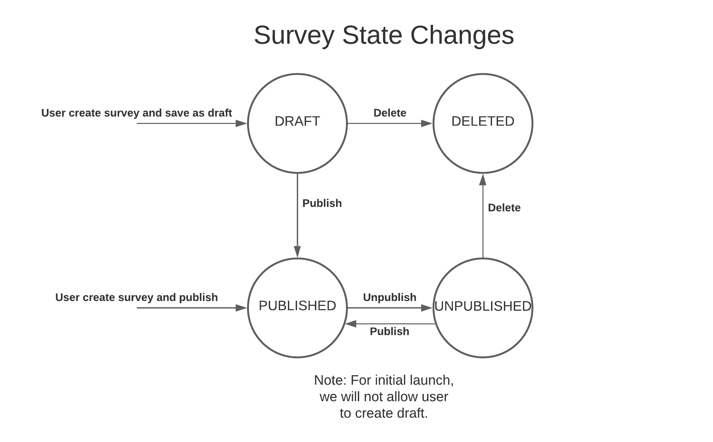

## Introduction

X-Choice is a survey platform which can allow users to publish surveys quickly.

This package is the backend service for the application. For an overview of the project and the front end package, please check [xchoice-web](https://github.com/kevinwchn/xchoice-web).
## Tech stack

- Java
- Spring & SpringBoot
- JUnit 5
- Mockito
- MySQL

## Local development

### Run dev server

I highly recommend using IntelliJ for Java development, which is the most powerful IDE for Java in my opinion. 

First, import project to IntelliJ by selecting `pom.xml` file and import as project. IntelliJ will automatically download and index dependencies for you.

To run the development server:

Go to `src/main/java/XChoiceApplication` and run the main function. By default, it will run on port 8080.

Since this service calls MySQL database, to avoid exposing the database login credentials, I've taken the approach to use env variables. Thus to run locally, you need the following env variables: `DB_URL`, `DB_USERNAME`, and `DB_PASSWORD`. Those can be configured in your `.bash_profile` or `.zshrc` depending on which one your desktop is using. Because of the same security concern, I will not post the names here, thus please drop me a message or email kangxu.wang@outlook.com for variable details.

### Run unit tests

In IntelliJ, right click on `src/test/java` folder and select Run 'All Tests'.

## DB Design
### ER Diagrams
If we require survey takers to log in to take the survey (in other words survey can only be taken by authed users), here's the ER diagram:

In this model, taker can be the publisher and vise versa.

If we consider survey taker to be anyone (including the audience who don't log in), here is the ER diagram:

In this model taker and publisher are modeled separately. For simplicity, we didn't even model taker in the DB.

Comparing those two models, I picked the latter one since most of the survey apps can collect responses from public. Forcing them to log in can increase friction. And we are not providing additional values if they log in. Based on future needs, we can re-evaluate the need to modeling authed taker.

## API Design

### Survey State Change
At a given time, a survey can be in `DRAFT`, `PUBLISHED`, `UNPUBLISHED`, `CANCELED` states.

| State | Behavior to survey participant | Behavior to publisher |
| ---- | ---- | --- |
| `DRAFT` | invisible | visible and editable |
| `PUBLISHED` | visible and workable | visible but not editable |
| `UNPUBLISHED` | invisible | visible and editable |
| `DELETED` | invisible | invisible |

## Appendix

### References
